# Terraform Multi-Cloud Hybrid Landing Zone

Enterprise-grade multi-cloud landing zone with AWS, Azure, and GCP — featuring cross-cloud VPN connectivity, centralized logging, and automated infrastructure management.

> **ITA:** Landing zone enterprise multi-cloud con connettività cross-cloud VPN, logging centralizzato e gestione infrastruttura automatizzata.

## Architecture / Architettura

```mermaid
graph TB
    subgraph AWS["AWS (eu-west-1)"]
        direction TB
        AWS_VPC["VPC 10.0.0.0/16"]
        AWS_PUB["Public Subnets<br/>ALB + NAT GW"]
        AWS_PRV["Private Subnets<br/>EC2 ASG + NGINX"]
        AWS_DAT["Data Subnets"]
        AWS_R53["Route53 DNS"]
        AWS_CW["CloudWatch<br/>Monitoring + Alerts"]

        AWS_VPC --> AWS_PUB
        AWS_VPC --> AWS_PRV
        AWS_VPC --> AWS_DAT
    end

    subgraph Azure["Azure (westeurope)"]
        direction TB
        AZ_VNET["VNet 10.1.0.0/16"]
        AZ_WEB["Web Subnet<br/>Azure LB"]
        AZ_APP["App Subnet<br/>VMSS + NGINX"]
        AZ_DAT["Data Subnet"]
        AZ_DNS["Private DNS"]
        AZ_MON["Log Analytics<br/>App Insights"]

        AZ_VNET --> AZ_WEB
        AZ_VNET --> AZ_APP
        AZ_VNET --> AZ_DAT
    end

    subgraph GCP["GCP (europe-west1)"]
        direction TB
        GCP_VPC["VPC Network"]
        GCP_WEB["Web Subnet<br/>HTTPS LB"]
        GCP_APP["App Subnet<br/>MIG + NGINX"]
        GCP_DAT["Data Subnet"]
        GCP_DNS["Cloud DNS"]
        GCP_MON["Cloud Monitoring<br/>Cloud Logging"]

        GCP_VPC --> GCP_WEB
        GCP_VPC --> GCP_APP
        GCP_VPC --> GCP_DAT
    end

    subgraph CrossCloud["Cross-Cloud Connectivity"]
        VPN["IPsec VPN<br/>AWS ↔ Azure"]
        LOGS["Centralized Logging<br/>S3 + GCS + Log Analytics"]
    end

    AWS_VPC <--> VPN
    AZ_VNET <--> VPN
    AWS_CW --> LOGS
    AZ_MON --> LOGS
    GCP_MON --> LOGS

    style AWS fill:#FF9900,color:#000
    style Azure fill:#0078D4,color:#fff
    style GCP fill:#4285F4,color:#fff
    style CrossCloud fill:#333,color:#fff
```



## Features / Funzionalità

| Feature | Description |
|---------|-------------|
| **3-Tier Networking** | Public/Private/Data subnets across all clouds |
| **Auto Scaling** | ASG (AWS), VMSS (Azure), MIG (GCP) with CPU-based scaling |
| **Load Balancing** | ALB (AWS), Azure LB, HTTP(S) LB (GCP) with health checks |
| **NGINX + SSL** | Auto-configured on all instances via user_data/cloud-init |
| **Cross-Cloud VPN** | IPsec tunnel between AWS VPC and Azure VNet |
| **Centralized Logging** | CloudWatch → S3, Log Analytics, Cloud Logging → GCS |
| **DNS Management** | Route53, Azure Private DNS, Cloud DNS |
| **Security** | NSG/SG rules, IAM least privilege, managed identities, encryption |
| **Monitoring** | CloudWatch dashboards, Azure alerts, GCP uptime checks |
| **CI/CD** | GitHub Actions with plan/apply, Infracost, drift detection |

## Prerequisites / Prerequisiti

- **Terraform** >= 1.9.0
- **AWS CLI** configured with appropriate credentials
- **Azure CLI** (`az login`) with active subscription
- **GCP CLI** (`gcloud auth`) with active project
- **GitHub** repository with secrets configured (see CI/CD section)

### Required Secrets (GitHub Actions)

| Secret | Description |
|--------|-------------|
| `AWS_ROLE_ARN` | IAM role ARN for OIDC authentication |
| `AZURE_CLIENT_ID` | Azure AD app registration client ID |
| `AZURE_TENANT_ID` | Azure AD tenant ID |
| `AZURE_SUBSCRIPTION_ID` | Azure subscription ID |
| `GCP_WORKLOAD_IDENTITY_PROVIDER` | GCP Workload Identity provider |
| `GCP_SERVICE_ACCOUNT` | GCP service account email |
| `INFRACOST_API_KEY` | Infracost API key (optional) |

## Quick Start / Avvio Rapido

### 1. Clone & Configure

```bash
git clone https://github.com/your-org/terraform-multi-cloud-hybrid.git
cd terraform-multi-cloud-hybrid

# Copy and edit variables
cp environments/dev/terraform.tfvars.example environments/dev/terraform.tfvars
vim environments/dev/terraform.tfvars
```

### 2. Initialize & Plan

```bash
# Using Make
make init ENV=dev
make plan ENV=dev

# Or directly
cd environments/dev
terraform init -upgrade
terraform plan -var-file=terraform.tfvars -out=tfplan
```

### 3. Apply

```bash
make apply ENV=dev
# or
terraform apply tfplan
```

### 4. Verify

```bash
# Check outputs
terraform output

# Test endpoints
curl -k https://$(terraform output -raw aws_alb_dns_name)/health
curl -k https://$(terraform output -raw azure_lb_public_ip)/health
curl -k https://$(terraform output -raw gcp_lb_ip)/health
```

## Environment Sizing / Dimensionamento

| Resource | Dev | Staging | Production |
|----------|-----|---------|------------|
| **AWS EC2** | t3.micro (1 inst) | t3.small (2 inst) | t3.medium (3-10 inst) |
| **Azure VMSS** | B1s (1 inst) | B2s (2 inst) | D2s_v5 (3-10 inst) |
| **GCP GCE** | e2-micro (1 inst) | e2-small (2 inst) | e2-standard-2 (3-10 inst) |
| **AWS NAT** | Single | Single | Per-AZ (HA) |
| **Azure Zones** | Single | Single | Zone-balanced |
| **VPN** | Disabled | Optional | Enabled |
| **Log Retention** | 30 days | 60 days | 90 days |

## Module Structure / Struttura Moduli

```
modules/
├── aws/
│   ├── network/      # VPC, subnets, NAT GW, VPC endpoints, flow logs
│   ├── compute/      # Launch Template, ASG, ALB, target groups
│   ├── security/     # Security groups, IAM roles, instance profiles
│   ├── monitoring/   # CloudWatch log groups, alarms, dashboards, SNS
│   └── dns/          # Route53 zones, records, health checks
├── azure/
│   ├── network/      # VNet, subnets, NSGs, route tables, VPN GW
│   ├── compute/      # VMSS, Azure LB, autoscale settings
│   ├── security/     # Key Vault, managed identity, storage logs
│   ├── monitoring/   # Log Analytics, App Insights, metric alerts
│   └── dns/          # Private DNS zones, VNet links
├── gcp/
│   ├── network/      # VPC, subnets, Cloud Router, Cloud NAT, firewall
│   ├── compute/      # Instance template, MIG, HTTP(S) LB, autoscaler
│   ├── security/     # Service accounts, IAM, Cloud Armor
│   ├── monitoring/   # Alert policies, uptime checks, log sinks
│   └── dns/          # Cloud DNS zones, records
└── cross-cloud/
    ├── vpn/          # AWS-Azure IPsec VPN tunnel
    └── logging/      # Centralized logging across clouds
```

## Teardown / Distruzione

```bash
# Destroy in reverse order
make destroy ENV=dev

# Or manually
cd environments/dev
terraform destroy -var-file=terraform.tfvars -auto-approve
```

> **Warning/Attenzione:** Production has deletion protection enabled on ALB and Key Vault. Remove protection before destroying.

## Security Best Practices

- All instances in private subnets (no public IPs)
- IMDSv2 enforced on AWS EC2
- Managed identities on Azure (no service principal keys)
- Shielded VMs on GCP
- Encryption at rest on all storage
- VPC Flow Logs / NSG Flow Logs enabled
- Least-privilege IAM roles
- Key Vault for secrets management
- Cloud Armor WAF rules (XSS, SQLi protection)

## CI/CD Pipeline

```
PR Created → fmt check → validate → security scan (tfsec + checkov)
                                          ↓
                                    terraform plan → Infracost comment → PR review
                                          ↓
Merge to main → terraform apply (dev → stg → prd, sequential)

Scheduled (weekday 06:00) → drift detection → auto-create issue if drift found
```

## Cost Optimization / Ottimizzazione Costi

- Dev: single NAT GW, minimal instances, short log retention
- Use `infracost` for cost estimation before apply
- Auto-scaling configured to scale down during low traffic
- S3/GCS lifecycle policies move logs to cold storage
- VPC endpoints reduce NAT GW data transfer costs

## Contributing

1. Create a feature branch
2. Run `make pre-commit` before pushing
3. Open a PR — plan runs automatically
4. Get approval — apply runs on merge

## License

MIT

---

*Built with Terraform by Senior Cloud Architects. Infrastructure as Code, done right.*
