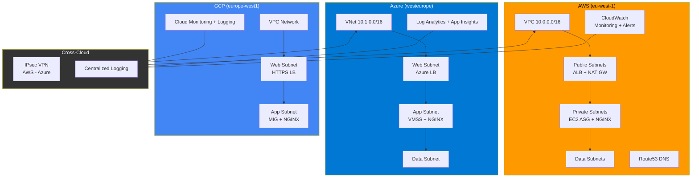

# Terraform Multi-Cloud Hybrid Landing Zone

Enterprise-grade multi-cloud landing zone with AWS, Azure, and GCP — featuring cross-cloud VPN connectivity, centralized logging, and automated infrastructure management.

> **ITA:** Landing zone enterprise multi-cloud con connettivita cross-cloud VPN, logging centralizzato e gestione infrastruttura automatizzata.

## Architecture / Architettura



## Features / Funzionalita

| Feature | Description |
|---------|-------------|
| **3-Tier Networking** | Public/Private/Data subnets across all clouds |
| **Auto Scaling** | ASG (AWS), VMSS (Azure), MIG (GCP) with CPU-based scaling |
| **Load Balancing** | ALB, Azure LB, HTTP(S) LB with health checks |
| **NGINX + SSL** | Auto-configured on all instances via user_data/cloud-init |
| **Cross-Cloud VPN** | IPsec tunnel between AWS VPC and Azure VNet |
| **Centralized Logging** | CloudWatch, Log Analytics, Cloud Logging |
| **DNS Management** | Route53, Azure Private DNS, Cloud DNS |
| **Security** | SG/NSG, IAM least privilege, managed identities, encryption |
| **Monitoring** | Dashboards, alerts, uptime checks across all clouds |
| **CI/CD** | GitHub Actions with plan/apply, Infracost, drift detection |

---

## Quick Start (One Command) / Avvio Rapido

```bash
git clone https://github.com/GiulioSavini/terraform-multi-cloud-hybrid.git
cd terraform-multi-cloud-hybrid

# One command to set everything up
./scripts/bootstrap.sh dev
```

The bootstrap script will:
1. Validate all prerequisites (terraform, aws, az, gcloud, etc.)
2. Install pre-commit hooks
3. Create remote state backends (S3, Azure Blob, GCS)
4. Auto-discover your cloud variables and generate `terraform.tfvars`
5. Initialize Terraform

> **ITA:** Lo script bootstrap fa tutto: valida i prerequisiti, crea i backend remoti, scopre le variabili dai cloud provider e inizializza Terraform.

---

## Manual Setup / Setup Manuale

### Prerequisites / Prerequisiti

| Tool | Version | Install |
|------|---------|---------|
| Terraform | >= 1.9.0 | [hashicorp.com/terraform](https://developer.hashicorp.com/terraform/install) |
| AWS CLI | v2 | `pip install awscli` |
| Azure CLI | latest | `curl -sL https://aka.ms/InstallAzureCLIDeb \| sudo bash` |
| GCP CLI | latest | [cloud.google.com/sdk](https://cloud.google.com/sdk/docs/install) |
| jq | any | `sudo apt install jq` |

Optional: `tflint`, `tfsec`, `checkov`, `infracost`, `pre-commit`, `terragrunt`

Validate all at once:

```bash
./scripts/validate-prereqs.sh
```

### Step-by-Step / Passo per Passo

```bash
# 1. Authenticate to all clouds
aws configure                              # AWS
az login                                   # Azure
gcloud auth application-default login      # GCP

# 2. Auto-generate terraform.tfvars from your cloud config
./scripts/get-variables.sh dev

# 3. Review generated variables
cat environments/dev/terraform.tfvars

# 4. Create remote state backends
./scripts/setup-backend.sh dev

# 5. Initialize and plan
make init ENV=dev
make plan ENV=dev

# 6. Apply
make apply ENV=dev

# 7. Verify endpoints
curl -k https://$(terraform output -raw aws_alb_dns_name)/health
curl -k https://$(terraform output -raw azure_lb_public_ip)/health
curl -k https://$(terraform output -raw gcp_lb_ip)/health
```

---

## Scripts Reference / Riferimento Script

| Script | Description |
|--------|-------------|
| `scripts/bootstrap.sh [env]` | One-command complete setup (validates + backend + tfvars + init) |
| `scripts/validate-prereqs.sh` | Check all required tools and cloud authentication |
| `scripts/get-variables.sh [env]` | Auto-discover cloud config and generate `terraform.tfvars` |
| `scripts/setup-backend.sh [env]` | Create remote state backends (S3+DynamoDB, Azure Blob, GCS) |
| `scripts/destroy-all.sh [env]` | Safe teardown with confirmations (triple confirm for prod) |

---

## Examples / Esempi

Ready-to-use examples for different deployment scenarios:

| Example | Description | Path |
|---------|-------------|------|
| **Complete** | Full AWS + Azure + GCP with cross-cloud logging | `examples/complete/` |
| **AWS Only** | VPC + ALB + ASG + NGINX + CloudWatch | `examples/aws-only/` |
| **Azure Only** | VNet + VMSS + LB + NGINX + Log Analytics | `examples/azure-only/` |
| **GCP Only** | VPC + MIG + HTTPS LB + NGINX + Monitoring | `examples/gcp-only/` |

```bash
# Run any example
cd examples/aws-only
terraform init
terraform apply
```

---

## Environment Sizing / Dimensionamento

| Resource | Dev | Staging | Production |
|----------|-----|---------|------------|
| **AWS EC2** | t3.micro (1) | t3.small (2) | t3.medium (3-10) |
| **Azure VMSS** | B1s (1) | B2s (2) | D2s_v5 (3-10) |
| **GCP GCE** | e2-micro (1) | e2-small (2) | e2-standard-2 (3-10) |
| **AWS NAT** | Single | Single | Per-AZ (HA) |
| **Azure Zones** | Single | Single | Zone-balanced |
| **Cross-Cloud VPN** | Disabled | Optional | Enabled |
| **Log Retention** | 30 days | 60 days | 90 days |
| **Est. Cost/month** | ~$50 | ~$200 | ~$800+ |

---

## Project Structure / Struttura Progetto

```
terraform-multi-cloud-hybrid/
├── scripts/                    # Bootstrap, validation, variable discovery
│   ├── bootstrap.sh            # One-command setup
│   ├── validate-prereqs.sh     # Check tools + auth
│   ├── get-variables.sh        # Auto-generate tfvars
│   ├── setup-backend.sh        # Create remote backends
│   └── destroy-all.sh          # Safe teardown
├── environments/
│   ├── dev/                    # Development (small, cost-optimized)
│   ├── stg/                    # Staging (medium, pre-prod)
│   └── prd/                    # Production (HA, multi-AZ)
├── modules/
│   ├── aws/
│   │   ├── network/            # VPC, 3-tier subnets, NAT, endpoints
│   │   ├── compute/            # ALB + ASG + NGINX (user_data.sh)
│   │   ├── security/           # Security Groups, IAM, instance profiles
│   │   ├── monitoring/         # CloudWatch alarms, dashboards, SNS
│   │   └── dns/                # Route53 zones, records, health checks
│   ├── azure/
│   │   ├── network/            # VNet, subnets, NSGs, VPN Gateway
│   │   ├── compute/            # VMSS + LB + NGINX (cloud_init.yaml)
│   │   ├── security/           # Key Vault, managed identity
│   │   ├── monitoring/         # Log Analytics, App Insights, alerts
│   │   └── dns/                # Private DNS zones, VNet links
│   ├── gcp/
│   │   ├── network/            # VPC, subnets, Cloud NAT, firewall
│   │   ├── compute/            # MIG + HTTPS LB + NGINX (startup_script.sh)
│   │   ├── security/           # Service accounts, Cloud Armor
│   │   ├── monitoring/         # Alert policies, uptime checks, log sinks
│   │   └── dns/                # Cloud DNS zones, records
│   └── cross-cloud/
│       ├── vpn/                # AWS-Azure IPsec VPN tunnel
│       └── logging/            # Centralized logging across clouds
├── examples/
│   ├── complete/               # Full multi-cloud deployment
│   ├── aws-only/               # AWS-only landing zone
│   ├── azure-only/             # Azure-only landing zone
│   └── gcp-only/               # GCP-only landing zone
├── .github/
│   ├── workflows/
│   │   ├── terraform.yml       # CI/CD: plan on PR, apply on merge
│   │   └── drift-detection.yml # Scheduled drift checks
│   ├── ISSUE_TEMPLATE/         # Bug report + feature request templates
│   ├── PULL_REQUEST_TEMPLATE.md
│   └── CODEOWNERS
├── .tflint.hcl                 # TFLint configuration
├── .pre-commit-config.yaml     # Pre-commit hooks (tfsec, tflint, checkov)
├── Makefile                    # make init/plan/apply/destroy/lint/security
├── Dockerfile                  # Dockerized workspace with all tools
├── terragrunt.hcl              # Terragrunt root configuration
├── CONTRIBUTING.md             # How to contribute
├── SECURITY.md                 # Security policy
├── CHANGELOG.md                # Version history
└── LICENSE                     # MIT
```

---

## Makefile Commands

```bash
make help        # Show all commands
make init        # terraform init (ENV=dev|stg|prd)
make plan        # terraform plan
make apply       # terraform apply
make destroy     # terraform destroy
make fmt         # Format all .tf files
make validate    # Validate configuration
make lint        # Run TFLint
make security    # Run tfsec + checkov
make cost        # Estimate costs with Infracost
make pre-commit  # Run all pre-commit hooks
make docker-shell # Launch Dockerized workspace
```

---

## Teardown / Distruzione

```bash
# Safe destroy with confirmations
./scripts/destroy-all.sh dev

# Or via Makefile
make destroy ENV=dev
```

> Production requires typing `DESTROY-PRODUCTION` to confirm.

---

## CI/CD Pipeline

```
PR Created --> fmt --> validate --> tfsec + checkov --> terraform plan --> Infracost --> Review
                                                                                        |
Merge to main --------> terraform apply (dev --> stg --> prd, sequential) <--------------

Cron (weekday 06:00) --> drift detection --> auto-create GitHub issue if drift found
```

### Required GitHub Secrets

| Secret | Description |
|--------|-------------|
| `AWS_ROLE_ARN` | IAM role for OIDC auth |
| `AZURE_CLIENT_ID` | Azure AD app client ID |
| `AZURE_TENANT_ID` | Azure AD tenant ID |
| `AZURE_SUBSCRIPTION_ID` | Azure subscription |
| `GCP_WORKLOAD_IDENTITY_PROVIDER` | GCP WIF provider |
| `GCP_SERVICE_ACCOUNT` | GCP service account |
| `INFRACOST_API_KEY` | Infracost API key (optional) |

---

## Security Best Practices

- All instances in private subnets (no public IPs)
- IMDSv2 enforced on AWS EC2
- Managed identities on Azure (no service principal keys)
- Shielded VMs on GCP
- Encryption at rest on all storage
- VPC Flow Logs / NSG Flow Logs enabled
- Least-privilege IAM roles
- Key Vault for secrets management
- Cloud Armor WAF rules (XSS, SQLi protection)
- Pre-commit hooks enforce security scanning before every commit

---

## Contributing

See [CONTRIBUTING.md](CONTRIBUTING.md) for detailed guidelines.

```bash
# Quick start for contributors
git checkout -b feat/my-feature
make pre-commit              # Run all checks
git commit -m "feat: add X"
git push origin feat/my-feature
# Open PR - plan runs automatically
```

## License

[MIT](LICENSE)

---

*Built with Terraform by Senior Cloud Architects. Infrastructure as Code, done right.*
